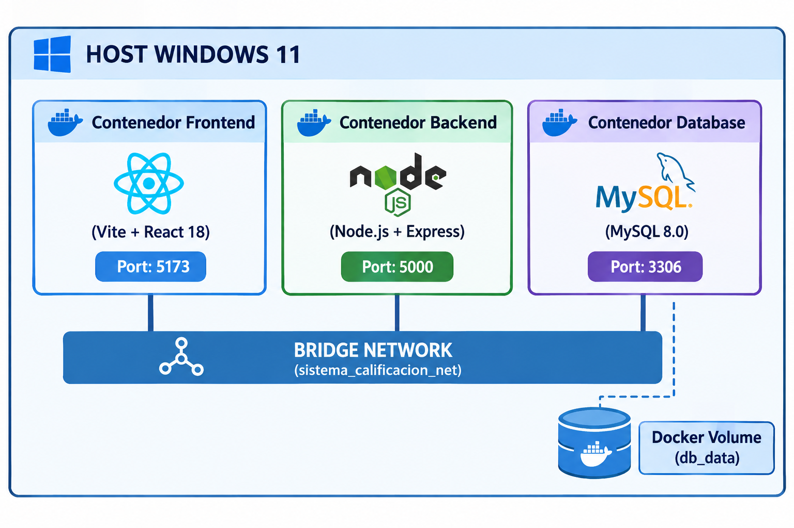
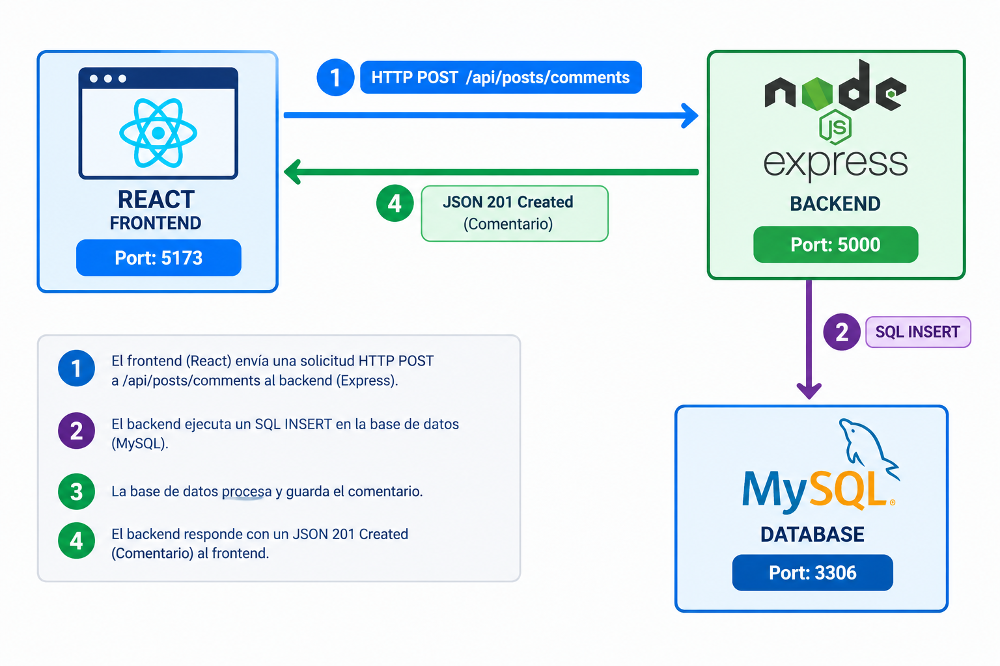

 
 

{width=300}  

# Informe Técnico Sistema de Calificación

### Universidad de San Carlos de Guatemala

### Practicas Iniciales

|Nombre|Carne|
|---|---|
|José Miguel Vásquez Velasquez | 2002-13161|
|Juan Pablo Tepeu Pacay|2023-08216|

---

- ### Introducción

El presente Informe Técnico detalla el diseño, la codificación e implementación del Sistema de Calificación.

- ### Objetivos

--- 
Vincular al estudiante con la arquitectura de desarrollo web basada en Frameworks modernos, control de versiones y gestión de datos.
Implementar el uso de repositorios distribuidos para la administración del código fuente y el trabajo colaborativo.
Diseñar y administrar una base de datos relacional para la persistencia de información del sistema.
Desarrollar una arquitectura Cliente-Servidor integrada mediante un servicioWeb REST API.

### Desarrollo
#### Arquitectura General y Tecnologías

 
El proyecto se estructura bajo una arquitectura de tres capas (3-Tier Architecture) completamente contenedorizada mediante Docker y coordinada con Docker Compose. Esta separación garantiza el aislamiento de entornos, la escalabilidad horizontal de servicios backend y la persistencia estructurada de datos.

  

{width=400}  

 

**Stack Tecnológico**

|Capa|Tecnología|Versión|Rol / Justificación Técnica|
|--|--|--|--|
|Frontend|React|18.x|Biblioteca orientada a componentes reactivos para construir la SPA (Single Page Application).|
| |Vite|5.x|Herramienta de compilación ultrarrápida impulsada por ES Modules y HMR (Hot Module Replacement).|
| |Tailwind CSS|3.x|Framework CSS utilitario para diseño responsivo con sistema de clases atomizadas y modo oscuro nativo.|
|Backend|Node.js|20.x|Entorno de ejecución I/O asíncrono no bloqueante basado en el motor V8 de Google.|
| |Express|4.x|Framework de enrutamiento HTTP para la exposición de endpoints RESTful.|
| |mysql2/promise|3.x|Driver nativo MySQL para Node.js con soporte completo para consultas preparadas y async/await.|
|Base de Datos|MySQL Community|8.0.46|"RDBMS relacional motor InnoDB, configurado para garantizar transacciones ACID y cumplimiento estricto de FKs."|
|Infraestructura|Docker Compose|v2.x|Orquestador multi-contenedor local con soporte de comprobación de salud (healthcheck) y volúmenes persistentes.|

**Flujo de Comunicación End-to-End (BD - Backend - Frontend)**

El intercambio de información sigue una arquitectura orientada a servicios REST sobre protocolo HTTP/1.1 y JSON como formato de intercambio de datos.

  

{width=400}  

 

**Ciclo de Vida de una Petición: Inserción de Comentario**
 - **Disparo de Evento en el Frontend (Feed.jsx):**
	- El usuario escribe un mensaje en el campo de texto y presiona "Comentar". Se ejecuta handleAddComment(codigo_publicacion, e).

 - **Formulación de la Petición HTTP:**
	- React invoca la API fetch nativa enviando un encabezado Content-Type: application/json y un cuerpo serializado:

 - **Recepción y Enrutamiento en Express (index.js & apiRoutes.js):**

	- El middleware express.json() analiza el buffer entrante y lo deserializa en req.body.

	- La petición es canalizada desde el prefijo /api hacia la ruta POST /posts/comments, delegando el control a postController.addComment.

 - **Validación y Ejecución Transaccional en MySQL (postController.js):**

	- El controlador valida la integridad de los parámetros requeridos (carne, codigo_publicacion, contenido).

	- El driver mysql2/promise toma una conexión del Connection Pool y ejecuta una consulta preparada (Prepared Statement) enviando marcadores de posición (?) para precaver inyecciones SQL:

 - **Respuesta Transaccional y Re-renderizado Reactivo:**

	- MySQL retorna un objeto de confirmación de inserción al backend.

	- Express responde con código 201 Created y payload JSON: { "message": "Comentario agregado exitosamente." }.

	- El frontend recibe la confirmación, limpia el input local mediante hooks de estado (useState) y re-ejecuta fetchPosts() para solicitar el estado actualizado del feed.

  

#### Modelo de Datos y Esquema de Base de Datos
El diseño de la base de datos sistema_calificacion está normalizado hasta la Tercera Forma Normal (3FN).

{width=400}  

 

#### Especificación Detallada de la API REST

Todas las llamadas API expuestas por la aplicación Express se agrupan bajo el prefijo universal /api.

**Autenticación (authController.js)**
- Registro de un nuevo usuario en la plataforma.
~~~
POST /api/auth/register
~~~

- Autentica las credenciales de acceso de un estudiante.
~~~
POST /api/auth/login
~~~

**Muro de Publicaciones y Comentarios (postController.js)**

- Obtener las publicaciones registradas con soporte de filtros dinámicos por nombre de curso o catedrático, incluyendo el arreglo estructurado de comentarios.
~~~
GET /api/posts
~~~

- Crea una nueva publicación vinculada a un curso y un catedrático.
~~~
POST /api/posts
~~~

- Registrar un comentario secundario dentro de una publicación existente.
~~~
POST /api/posts/comments
~~~

**Catálogos Académicos (catalogController.js)**
- Recuperar el listado completo de cursos ordenados alfabéticamente.
~~~
GET /api/courses
~~~

- Ingresar un nuevo curso dentro del catálogo general.
~~~
POST /api/courses
~~~

- Obtiene o crea registros dentro del catálogo de catedráticos.
~~~
GET /api/professors
~~~
~~~
POST /api/professors
~~~

**Perfil y Cursos Aprobados (profileController.js)**
- Obtener la información de perfil del estudiante y la lista de cursos que ha aprobado con su respectiva calificación.
~~~
GET /api/users/:carne
~~~

- Registrar un nuevo curso en el historial del estudiante.
~~~
POST /api/users/:carne/courses
~~~

**Configuración de Infraestructura y Despliegue (docker-compose.yml)**
El orquestador maneja variables de entorno, mapeo de puertos y la secuencia estricta de inicio mediante comprobación de estado de la base de datos (healthcheck).

~~~
version: '3.8'

services:
  db:
    image: mysql:8.0.46
    container_name: mi_mysql
    restart: always
    environment:
      MYSQL_ROOT_PASSWORD: passdb
      MYSQL_DATABASE: sistema_calificacion
      MYSQL_USER: user_sistema
      MYSQL_PASSWORD: userpassword
    ports:
      - "3306:3306"
    volumes:
      - db_data:/var/lib/mysql
      - ./sql:/docker-entrypoint-initdb.d
    healthcheck:
      test: ["CMD", "mysqladmin", "ping", "-h", "localhost", "-u", "root", "-prootpassword"]
      interval: 10s
      timeout: 5s
      retries: 5
    networks:
      - app_net

  backend:
    build:
      context: ./backend
      dockerfile: Dockerfile
    container_name: node_backend
    restart: always
    ports:
      - "5000:5000"
    environment:
      DB_HOST: db
      DB_USER: user_sistema
      DB_PASSWORD: userpassword
      DB_NAME: sistema_calificacion
      PORT: 5000
    depends_on:
      db:
        condition: service_healthy
    networks:
      - app_net

  frontend:
    build:
      context: ./frontend
      dockerfile: Dockerfile
    container_name: react_frontend
    restart: always
    ports:
      - "5173:5173"
    depends_on:
      - backend
    networks:
      - app_net

volumes:
  db_data:
    driver: local

networks:
  app_net:
    driver: bridge
~~~

### Conclusión

Realizar este proyecto ayudó a entender en la práctica cómo se conecta verdaderamente el frontend con el backend y la base de datos.
Logramos cumplir con todos los requisitos del enunciado creando una plataforma que sería bastante útil para los estudiantes.

