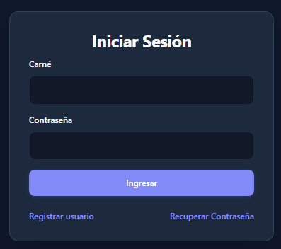
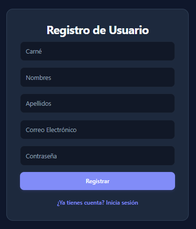
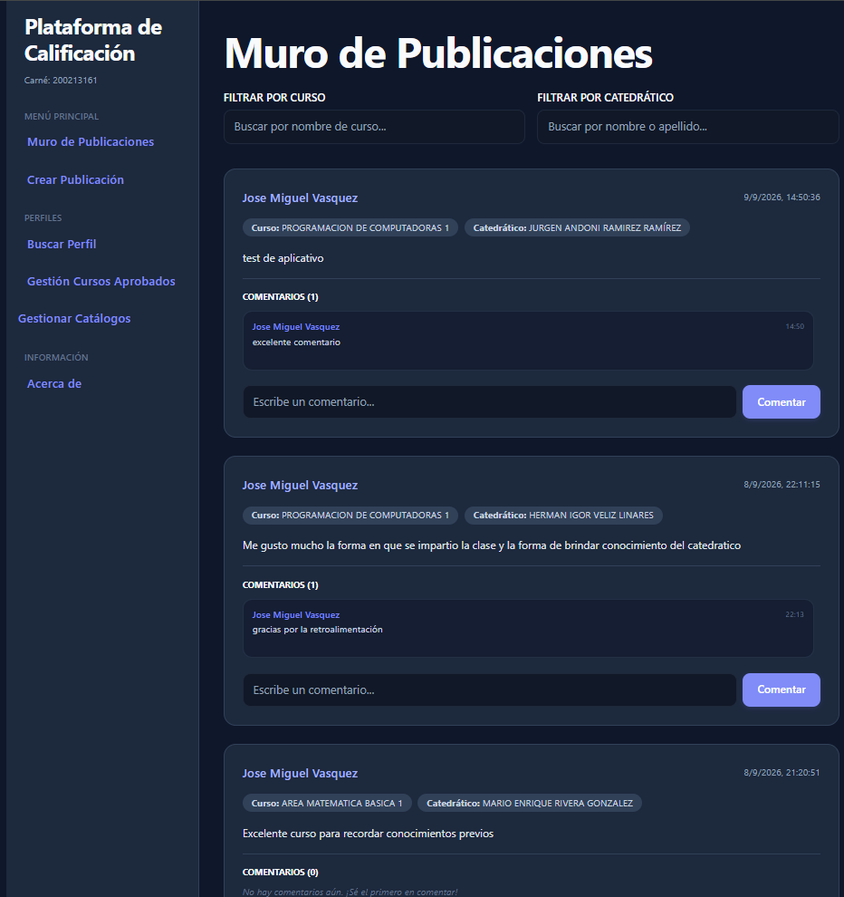
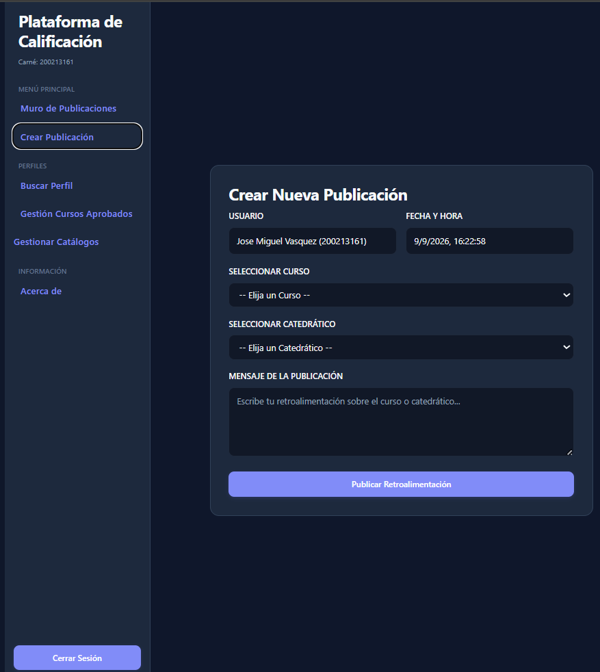
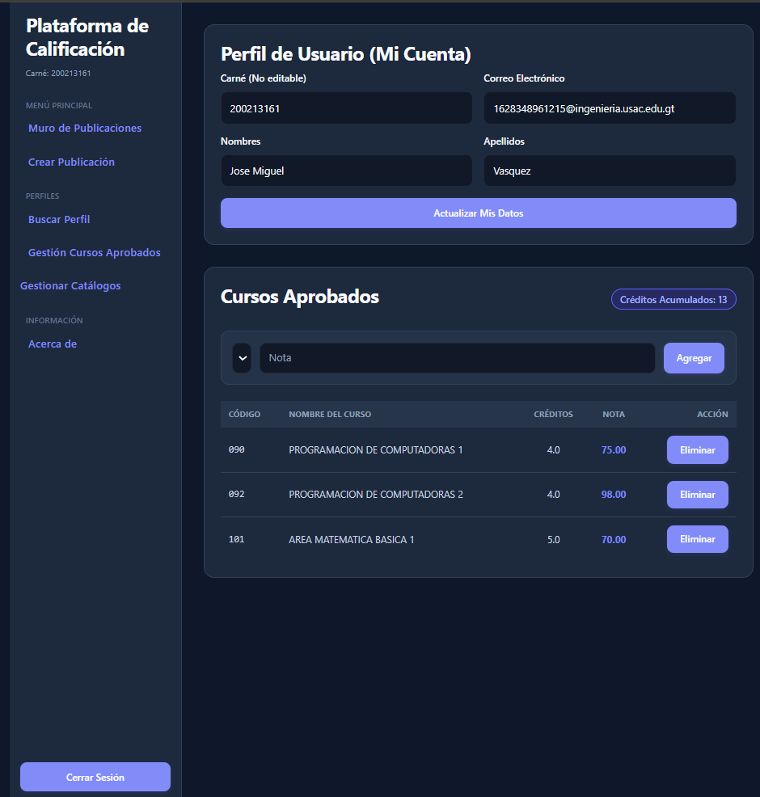
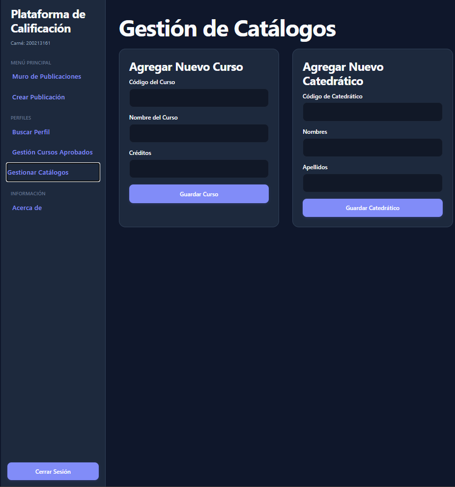
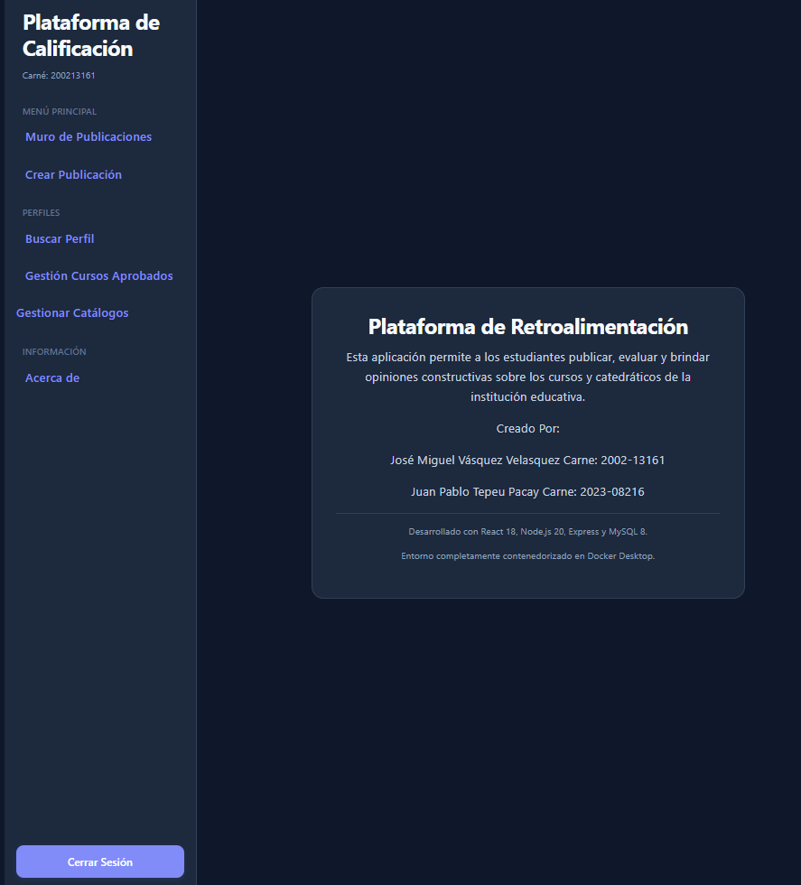

{width=300}

# Manual de Usuario Sistema de Calificación

### Universidad de San Carlos de Guatemala

### Practicas Iniciales

|Nombre|Carne|
|---|---|
|José Miguel Vásquez Velasquez | 2002-13161|
|Juan Pablo Tepeu Pacay|2023-08216|

---

- ### Introducción

El presente Manual de Usuario tiene como propósito guiar al estudiante en el uso de la nueva interfaz de la Plataforma de Calificación. A través del menú lateral izquierdo, el usuario podrá navegar ágilmente por todas las herramientas del sistema, desde la interacción con reseñas hasta la administración de su expediente.

---

### Guía de Navegación del Menú Principal

#### 1. Registro e Inicio de Sesión

Antes de acceder al menú principal, el estudiante debe identificarse. En la pantalla de inicio de sesión, basta con ingresar el número de carné y contraseña. Si el usuario es nuevo, debe navegar a la opción de Registro para crear su cuenta proporcionando sus datos personales e institucionales. En caso de olvido, se incluye una opción de recuperación de contraseña mediante validación de correo.

  
  

#### 2. Muro de Publicaciones

Es la pantalla principal del sistema. Aquí el estudiante puede leer las reseñas hechas por otros compañeros. Cuenta con dos herramientas superiores para <b>Filtrar por Curso</b> o <b>Filtrar por Catedrático</b>. Cada tarjeta de publicación muestra etiquetas identificativas y posee una sección desplegable para leer o escribir comentarios.

  

``

#### 3. Crear Publicación

Al seleccionar esta opción, se abrirá el formulario para redactar una nueva reseña. El estudiante podrá vincular su opinión a un curso y catedrático específico antes de publicarla en el muro general.

  

#### 4. Ver Perfil

Nos permite visualizar y editar datos del usuario en sesión a excepcion del carne, también nos muestra los cursos aprobador junto con sus respectivas notas y los creditos totales acumulados.

  

#### 5. Gestionar Catálogos

Este módulo permite visualizar y organizar los listados oficiales que alimentan el sistema, tales como la base de datos de cursos disponibles y el registro de catedráticos.

  

#### 6. Acerca de

Sección informativa ubicada en el área de Información, la cual detalla los datos de los desarrolladores, la versión actual de la plataforma y el propósito académico de la herramienta.

  

